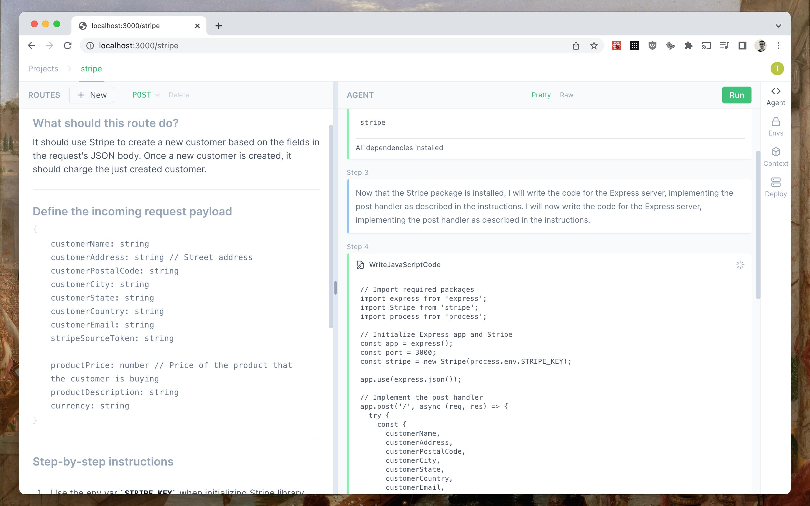

<h1 align="center">
  
  
</h1>

<p align="center">Open-source IDE powered by AI agents that do the work for you</p>

<h4 align="center">
  <a href="https://e2b.dev">Website</a> |
  <a href="https://discord.gg/U7KEcGErtQ">Discord</a> |
  <a href="https://twitter.com/e2b_dev">Twitter</a>
</h4>

<h4 align="center">
  <a href="https://discord.gg/U7KEcGErtQ">
    
  </a>
  <a href="https://twitter.com/e2b_dev">
    
  </a>
</h4>


*Example of AI agent building Stripe checkout. Left - technical specification written by human. Right - steps that the AI agent took and tools that it used to build the server route required by the specification.*

[e2b](https://e2b.dev) or etob (*english2bits*) is a new kind of development environment powered by AI. The main idea is that developers have access to AI agents that can use tools. 

The developer writes a short documentation or a technical spec in plain English and then lets the AI agent do the actual work. The AI agents have access to tools like writing to a file, running code, running commands, installing dependencies, deploying, etc. 

Agents operate in a secure sandboxed cloud environment that's powered by [Firecracker](https://github.com/firecracker-microvm/firecracker/). This way, you for example describe what a server route should do and the agent codes it for you. Like [this example](https://twitter.com/mlejva/status/1641072535163875330) of an AI agent coding Stripe customer checkout based on a technical spec.

e2b currently supports building only REST servers in Node.js. Specifically using the [Express](https://expressjs.com/) framework. We'll support more languages and frameworks with time. The goal for e2b is to eventually be able to handle any use-case.

# 🚀 Get started
We're working on the cloud-hosted version. In the meantime, the fastest way try out e2b is to run it locally via Docker.

## 🐳 Start e2b with Docker
You will need:
- [OpenAI API key](https://platform.openai.com/account/api-keys) (support for more and custom models coming soon)
- Docker
- Node.js *16+*
- Free ports 3000 (Next.js app), 54321 (Supabase API Gateway), 54322 (Supabase Database)

To start e2b run:
```
npm start
```

Then open page on [http://localhost:3000](http://localhost:3000).

`npm start` starts local Supabase in the background - to stop it you have to run `npm run stop`.

## 💻 Or start in development setup
For developing with hot reloading and contributing to the project you may want to run the app locally without Docker (`npm start` command). Here are the steps for how to do it.

You will need:
- OpenAI API key (support for more and custom models coming soon)
- Docker (For starting the Supabase DB locally)
- Node.js *16+*
- Python *3.10+*
- Poetry *1.3.2+*
- Free ports 3000, 49155, 49160, 54321, 54322

### 1. Install dependencies
```
npm run install:all
```

### 2. Start local Supabase
```
npm run db:start
```

Local Supabase runs in the background - to stop it you have to run `npm run db:stop`.

### 3. Add env vars
Create `.env` file by copying the [`.env.example`](.env.example)
```
cp .env.example .env
```
and fill in the following variables:
- `SUPABASE_SERVICE_ROLE_KEY` - Supabase service role key you got in the previous step as `service_role key: eyJh......`
- `NEXT_PUBLIC_SUPABASE_ANON_KEY` - Supabase anonymous key you got in the previous step as `anon key: eyJh......`

### 4. Start the app
```
npm run dev
```
Then open page on [http://localhost:3000](http://localhost:3000) and sign in with the testing credentials:

**Email**

`admin@admin.com`

**Password**

`admin@admin.com`


# Features
## 🛠 Bring your own X
While e2b will offer the "batteries-included" solution, our goal is to let users:
- **BYOM** - Bring Your Own Model
- **BYOP** - Bring Your Own Prompt
- **BYOT** - Bring Your Own Tools

We think the AI-powered IDE for the future should be open-sourced and allow anybody to bring their models, customize the prompts, and develop custom tools for the agents. But we also plan to offer a cloud version with some features behind subscription though.

## 🤖 Supported models and model hosting providers
- [x] [OpenAI](https://openai.com/)
  - [x] GPT-4
  - [x] GTP-3.5
- [ ] [Replicate](https://replicate.com/) 🚧
- [ ] [HuggingFace](https://huggingface.co/) 🚧
- [ ] [Anthropic](https://anthropic.com/) 🚧
  - [ ] Claude v1.3
  - [ ] Claude Instant v1

### **Model or model hosting provider you like isn't supported?**

👉 Please open the ["New model request" issue](https://github.com/e2b-dev/e2b/issues/new?assignees=&labels=new+model+request&template=new-model-request.md&title=) 👈

👉 Or open a PR and [start contributing](./CONTRIBUTING.md#🤖-adding-a-new-model-provider) 👈

## 👀 Early demos
- [AI Agent using coding tools](https://twitter.com/mlejva/status/1636103084802822151)
- [Build your custom "Just-In-Time" UI](https://twitter.com/mlejva/status/1641151421830529042)
- [Agent coded a full Stripe customer checkout by following a technical spec provided by user](https://twitter.com/mlejva/status/1641072535163875330)

# ℹ️ Community & Support
- [Discord](https://discord.gg/U7KEcGErtQ) - live discussion and support
- [GitHub issues](https://github.com/e2b-dev/e2b/issues) - for reporting bugs
- [Twitter](https://twitter.com/e2b_dev) - to stay up to date

# 📆 Roadmap
1. Make sure people can run e2b locally without issues and the DX is smooth.
2. Add support for more models.
    - Let users request new models. Later create a system that will let users use any model.
3. Improve model's understanding of the context based on the instructions
4. Support for more tools
5. Improve the dashboard UI
6. Let users edit prompt
7. Let users customize tools and build custom workflows for the agent
8. Release cloud version
